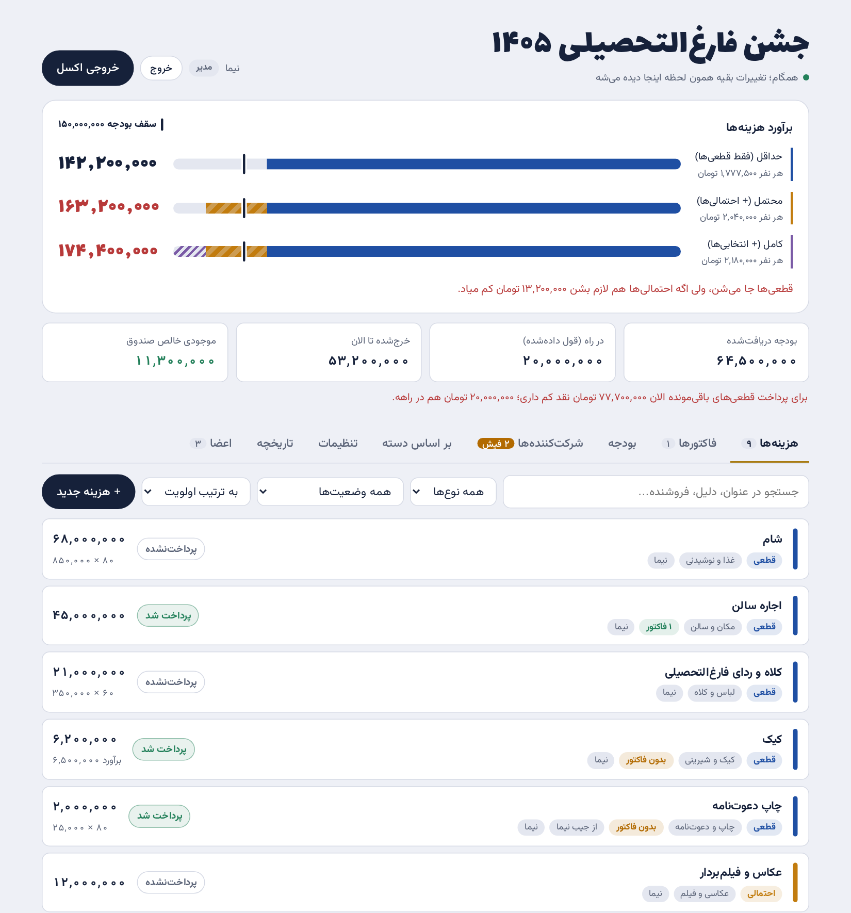

# دخل و خرج جشن فارغ‌التحصیلی

سایتی ساده و رایگان برای مدیریت مالی یک جشن یا رویداد جمعی. تیم مالی هزینه‌ها، فاکتورها و بودجه را در آن ثبت می‌کند. شرکت‌کننده‌ها از داخل تلگرام وارد می‌شوند، سهم خود را می‌بینند و عکس فیش واریزی‌شان را می‌فرستند.



<sub>تصویر بالا با داده‌ی ساختگی تهیه شده است.</sub>

## امکانات

- **برآورد هزینه در برابر بودجه:** هر هزینه «قطعی»، «احتمالی» یا «انتخابی» است. صفحه‌ی اصلی سه برآورد (حداقل، محتمل، کامل) را کنار سقف بودجه و سهم هر نفر نشان می‌دهد.
- **صندوق:** بودجه‌ی دریافت‌شده، پول در راه، خرج‌شده و موجودی، و هشدار وقتی نقدینگی برای هزینه‌های قطعی باقی‌مانده کافی نیست.
- **فاکتورها:** عکس یا PDF فاکتور به هزینه‌ی مربوط وصل می‌شود. هزینه‌های پرداخت‌شده‌ی بدون فاکتور مشخص می‌شوند.
- **شرکت‌کننده‌ها و پرداخت سهم:**
  - لیست ثبت‌نام از فایل Excel یا CSV وارد می‌شود.
  - هر نفر با شماره‌ای که تلگرام تأیید می‌کند وارد صفحه‌ی پرداخت خودش می‌شود و عکس فیش را می‌فرستد.
  - تیم مالی فیش‌ها را تأیید یا رد می‌کند.
- **نقش‌ها و تاریخچه:** هر کس فقط کارهایی را انجام می‌دهد که نقشش اجازه می‌دهد. هر تغییر با نام انجام‌دهنده و مقدار قبلی ثبت می‌شود.
- **همگام‌سازی زنده و خروجی اکسل.** فونت‌ها و کتابخانه‌ها همراه سایت هستند و سایت به CDN وابسته نیست.

## ساختار فایل‌ها

```
index.html                                  کل سایت (یک فایل)
config.js                                   آدرس Supabase، کلید عمومی و نام ربات تلگرام
schema.sql                                  ساختار دیتابیس، قوانین دسترسی، تاریخچه و فضای فایل‌ها
supabase/functions/telegram-auth/index.ts   تابع ورود با تلگرام و پاسخ‌گوی ربات (Edge Function)
vendor/ , fonts/                            کتابخانه‌ها و فونت‌ها
docs/                                       تصویر همین راهنما
```

## نقش‌ها

| نقش | دیدن و خروجی اکسل | افزودن و ویرایش | حذف | مدیریت اعضا |
|---|:-:|:-:|:-:|:-:|
| مدیر | ✓ | ✓ | ✓ | ✓ |
| ویرایشگر | ✓ | ✓ | ✗ | ✗ |
| بیننده | ✓ | ✗ | ✗ | ✗ |
| شرکت‌کننده | فقط صفحه‌ی پرداخت خودش | فقط فرستادن فیش | ✗ | ✗ |
| در انتظار تأیید | ✗ | ✗ | ✗ | ✗ |

- هر کسی که با تلگرام وارد شود، ابتدا «در انتظار تأیید» است.
- اگر شماره‌اش در لیست شرکت‌کننده‌ها باشد، با تأیید شماره در تلگرام خودکار شرکت‌کننده می‌شود.
- در غیر این صورت مدیر در تب **اعضا** نقشش را تعیین می‌کند.
- این محدودیت‌ها در خود دیتابیس (Row Level Security) اعمال می‌شوند، نه فقط در ظاهر سایت.

## راه‌اندازی

همه‌ی مراحل روی پلن رایگان Supabase و GitHub Pages انجام می‌شود.

### ۱) دیتابیس Supabase

1. در [supabase.com](https://supabase.com) یک پروژه‌ی جدید بسازید.
2. محتوای `schema.sql` را کپی کنید و در بخش ۱ آن، `me@example.com` را به ایمیل مدیر تغییر دهید. این ایمیل فقط در دیتابیس ذخیره می‌شود و لازم نیست در مخزن تغییر کند.
3. در **SQL Editor** متن را بچسبانید و **Run** را بزنید.

### ۲) حساب مدیر

1. در **Authentication → Users → Add user → Create new user** یک کاربر بسازید:
   - ایمیل: همان ایمیل مرحله‌ی قبل
   - یک رمز عبور
   - گزینه‌ی **Auto Confirm User** روشن

   این کاربر خودکار مدیر می‌شود. ترتیب این مرحله و مرحله‌ی ۱ مهم نیست.
2. در **Authentication → Sign In / Providers** گزینه‌ی **Allow new users to sign up** را خاموش کنید. ورود با تلگرام همچنان کار می‌کند، چون کاربرهای تلگرامی را تابع ورود می‌سازد.

ورود با ایمیل روی صفحه‌ی اصلی پنهان است. مدیر برای ورود با ایمیل، آدرس سایت را با `?email` در انتها باز می‌کند؛ مثلاً `https://username.github.io/grad-finance-site/?email`.

### ۳) ربات تلگرام

در تلگرام به [@BotFather](https://t.me/BotFather) پیام دهید:

1. `/newbot` را بفرستید، سپس یک نام و یک نام کاربری (مثلاً `PartyFinanceBot`) انتخاب کنید. **توکن** ربات را محرمانه نگه دارید.
2. `/setdomain` را بفرستید و ربات را انتخاب کنید. سپس فقط دامنه‌ی سایت را بفرستید، بدون `https://` و بدون مسیر؛ مثلاً `username.github.io`.

### ۴) تابع ورود تلگرام (Edge Function)

**از داشبورد Supabase:**

1. **Edge Functions → Deploy a new function → Via Editor** را بزنید.
   - نام تابع دقیقاً `telegram-auth` باشد.
   - محتوای `supabase/functions/telegram-auth/index.ts` را جای کد پیش‌فرض بچسبانید و **Deploy** کنید.
2. در تنظیمات تابع، **Verify JWT** (یا Enforce JWT verification) را خاموش کنید. کاربر هنگام ورود هنوز نشستی ندارد؛ امنیت ورود با بررسی امضای تلگرام داخل تابع تأمین می‌شود.
3. در **Edge Functions → Secrets** یک secret با نام `TELEGRAM_BOT_TOKEN` و مقدار توکن ربات اضافه کنید.

**یا با Supabase CLI:**

```bash
supabase functions deploy telegram-auth --no-verify-jwt
supabase secrets set TELEGRAM_BOT_TOKEN=123456:ABC...
```

هر بار که فایل تابع در مخزن تغییر می‌کند، باید دوباره Deploy شود.

### ۵) تنظیم `config.js`

مقدارها را از **Project Settings → API** بردارید:

| کلید | مقدار |
|---|---|
| `supabaseUrl` | آدرس پروژه، مثل `https://abcd1234.supabase.co` |
| `supabaseAnonKey` | کلید **anon** یا **publishable**. این کلید عمومی است. کلید `service_role` یا `secret` هرگز نباید این‌جا قرار بگیرد. |
| `telegramBot` | نام کاربری ربات، بدون `@` |
| `supportIds` | اختیاری: آیدی تلگرام مسئول‌های مالی، بدون `@`؛ مثلاً `['ali_finance']`. به کسی که شماره‌اش در لیست نیست، این آیدی‌ها برای پیگیری نشان داده می‌شوند. |

### ۶) انتشار روی GitHub Pages

1. مخزن را Fork کنید (یا فایل‌ها را در یک مخزن عمومی بگذارید).
2. در **Settings → Pages** گزینه‌ی **Deploy from a branch** را با شاخه‌ی `main` و پوشه‌ی root انتخاب کنید.

هیچ فایلی در مخزن اطلاعات محرمانه ندارد. کلید `config.js` عمومی است و ایمیل مدیر فقط در دیتابیس ذخیره می‌شود.

### ۷) فعال کردن دکمه‌ی ربات

بعد از بالا آمدن سایت، مدیر در تب **تنظیمات** دکمه‌ی **راه‌اندازی دکمه‌ی ربات** را می‌زند. از آن به بعد:

- هر کس ربات را Start کند، پیام خوش‌آمد با دکمه‌ی «ورود به سایت» می‌گیرد.
- دکمه‌ی منوی ربات سایت را داخل خود تلگرام (Mini App) باز می‌کند و کاربر بدون هیچ کلیکی وارد می‌شود.

## استفاده

### تیم مالی

- اعضای تیم با تلگرام وارد می‌شوند. مدیر در تب **اعضا** نقش هر نفر (بیننده، ویرایشگر یا مدیر) را تعیین می‌کند و همان لحظه صفحه‌ی آن فرد باز می‌شود.
- نام نمایشی هر عضو در همان تب قابل تغییر است. همین نام در تاریخچه و برچسب‌های «ثبت‌کننده» دیده می‌شود.
- «برداشتن دسترسی» عضو را حذف می‌کند. اگر دوباره وارد شود، درخواست جدید ثبت می‌شود.

### شرکت‌کننده‌ها و پرداخت سهم

1. **وارد کردن لیست:** در تب **شرکت‌کننده‌ها**، با **ورود از شیت** فایل ثبت‌نام (Excel یا CSV) وارد می‌شود.
   - ستون «شماره تماس» لازم است. «نام»، «گرایش» و «تعداد مهمان» هم خوانده می‌شوند.
   - عنوان ستون‌ها لازم نیست دقیق باشد؛ مثلاً «شماره تماس (ترجیحاً موبایل)» هم شناخته می‌شود.
   - تعداد مهمان می‌تواند «۲»، «۲ نفر»، «دو نفر» یا «ندارم» باشد. موارد مبهم قبل از وارد شدن برای بررسی نشان داده می‌شوند.
   - اگر در خانه‌ی شماره چیز دیگری هم نوشته شده باشد (آیدی تلگرام، یا دو شماره که کنار یکی «تلگرام» آمده)، شماره‌ی موبایل برداشته می‌شود و متن کامل در یادداشت آن نفر می‌ماند.
   - کسی که شماره‌ی معتبر ندارد با برچسب «بدون شماره» ثبت می‌شود. تا شماره‌اش اضافه نشود خودش نمی‌تواند وارد شود، ولی تیم مالی می‌تواند پرداختش را دستی ثبت کند.
   - وارد کردن دوباره‌ی همان فایل آدم تکراری نمی‌سازد.
2. **مبلغ سهم:** در **ویرایش اطلاعات پرداخت** شماره کارت، مبلغ پیش‌فرض سهم و مبلغ هر مهمان تعیین می‌شود. سهم هر نفر خودکار «سهم پیش‌فرض + تعداد مهمان × مبلغ هر مهمان» است. برای مبلغ متفاوت، «مبلغ کل» در پنجره‌ی همان نفر دستی نوشته می‌شود.
3. **ورود شرکت‌کننده:** هر نفر سایت را از ربات باز می‌کند و **📱 تأیید شماره با تلگرام** را می‌زند.
   - شماره از خود تلگرام گرفته و با لیست مقایسه می‌شود. شماره در هیچ‌جای سایت تایپ نمی‌شود.
   - کسی که سایت را در مرورگر باز کند، فقط دکمه‌ی باز کردن ربات را می‌بیند.
   - اگر شماره در لیست نباشد، به پیام دادن به مسئول‌های مالی راهنمایی می‌شود.
   - پس از تأیید، مبلغ سهم (با جزئیات مهمان‌ها) و اطلاعات کارت را می‌بیند و عکس فیش را می‌فرستد. عکس روی گوشی خودش فشرده می‌شود.
4. **بررسی فیش:** فیش‌ها در تب **شرکت‌کننده‌ها**، زیر «فیش‌های در انتظار بررسی» می‌آیند.
   - با **تأیید**، مبلغ به «سهم نفرات» در بودجه اضافه می‌شود.
   - با **رد**، دلیل رد به خود فرد نشان داده می‌شود.
   - برگرداندن فیش تأییدشده فقط کار مدیر است.
   - مدیر می‌تواند فیش (مثلاً فیش تکراری یا آزمایشی) را با **حذف فیش** کامل پاک کند. اگر فیش تأیید شده باشد، مبلغش هم از «سهم نفرات» کم می‌شود.
5. **پرداخت نقدی یا مستقیم:** برای پرداختی که مستقیم به تیم مالی رسیده، روی نام فرد بزنید و **+ ثبت پرداخت این نفر** را انتخاب کنید (عکس فیش اختیاری است). پرداخت همان لحظه تأیید می‌شود و وضعیت فرد هم درست می‌شود.
6. **چند نفر با یک شماره:** اگر چند نفر با یک شماره ثبت‌نام کرده باشند، هر کدام جدا ثبت می‌شوند و برچسب «شماره‌ی مشترک» می‌گیرند. صاحب شماره پس از ورود بین آن‌ها جابه‌جا می‌شود و برای هر کدام جدا فیش می‌فرستد.

## نکته‌ها

- **کاربرهای تلگرامی:** در Supabase با ایمیل ساختگی مثل `tg123456@telegram.local` ذخیره می‌شوند. این ایمیل واقعی نیست و چیزی به آن ارسال نمی‌شود.
- **دکمه‌ی ورود تلگرام در مرورگر:** فقط روی دامنه‌ای کار می‌کند که با `/setdomain` ثبت شده است (روی `localhost` یا با باز کردن مستقیم فایل کار نمی‌کند).
- **اسکریپت تلگرام:** اسکریپت Mini App تلگرام در `vendor/telegram-web-app.js` همراه سایت است. دلیلش این است که telegram.org در برخی شبکه‌ها در دسترس نیست و صفحه‌ی داخل تلگرام فایل‌ها را با اینترنت معمولی دستگاه بارگذاری می‌کند، نه از مسیر اتصال خود تلگرام.
- **خروجی اکسل:** برخی نسخه‌های تلگرام دانلود فایل را پشتیبانی نمی‌کنند؛ برای خروجی اکسل سایت را در مرورگر باز کنید.
- **توقف پروژه‌ی رایگان:** پروژه‌ی رایگان Supabase پس از حدود یک هفته بی‌استفاده ماندن متوقف می‌شود. داده‌ها حفظ می‌شوند و با **Restore** برمی‌گردند.
- **اجرای دوباره‌ی `schema.sql`:** روی پروژه‌ای که با همین فایل ساخته شده بی‌خطر است. داده‌ها پاک نمی‌شوند و فقط تابع‌ها و قوانین دسترسی دوباره ساخته می‌شوند.

## مجوز

[MIT](LICENSE)
